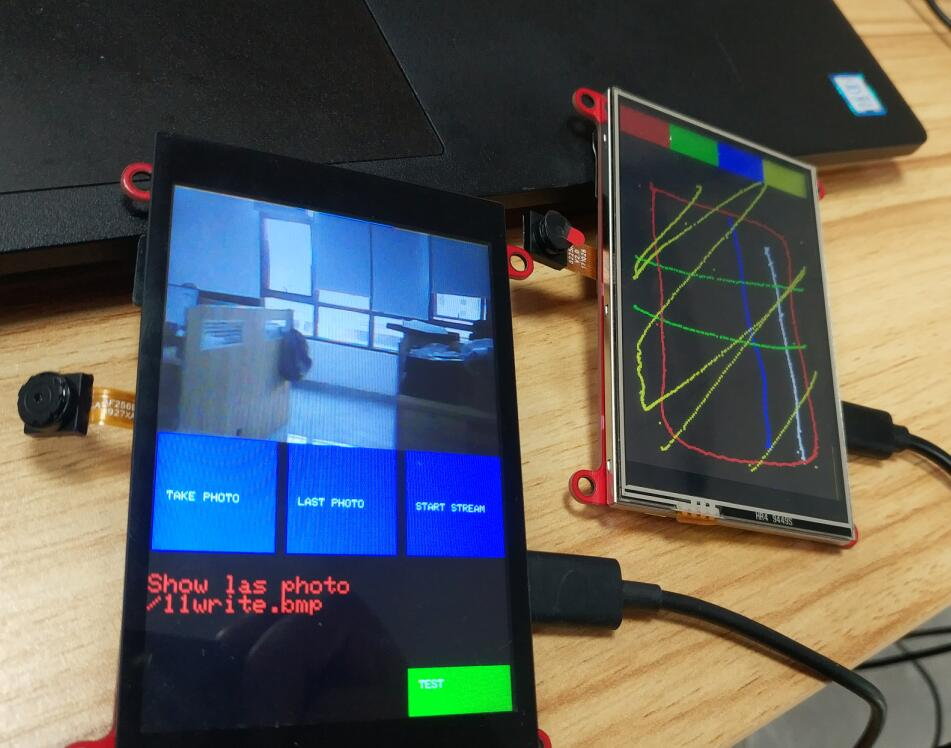
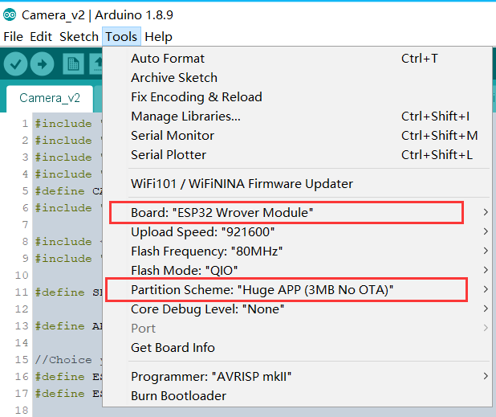

# Touch Screen Camera

```c++
/*
Version:		V3.1
Author:			Vincent
Create Date:	2020/8/19
Note:
	V3.1 : Replace the picture with the new hardware.
	V3.0 : Delete many useless code. Add FAQ.
	V2.0 : Change ILI9488 driver,use LovyanGFX lib.Ten times faster than before!!!
	
*/
```
[ESP32 Touch Camera](https://www.youtube.com/watch?v=zWUy4gcwMs4&feature=youtu.be)




[toc]

# OVERVIEW

## Introduce

[Makerfabs home page](https://www.makerfabs.com/)

[Makerfabs Wiki](https://makerfabs.com/wiki/index.php?title=Main_Page)

The realization of a simple digital camera, you can take pictures through the camera framing. It is displayed on the TFT screen and provides touch options. Photos taken can be saved on an SD card.

## Equipment list

- ESP32 Touch Camera
- Micro SD card


# ESP32 Touch Camera

## ~~Product link ：~~[ ~~ESP32 Touch Camera~~]() 

The ESP32 Touch Camera use ILI9488 screen, which comes with resistive or capacitive screens. Have an OV2640 camera and SD card slot. It can be used as a webcam, an electronic album, or a digital camera. Support for Arduino and MicroPython. 

## Feature

- Integrated ESP32 2.4G WiFi and Bluetooth.
- Micro SD card slot on board.
- Input 5.0V Type-C USB .
- OV2640 is a 1/4 inch CMOS UXGA (1632*1232) image sensor manufactured by OmniVision.
- LCD 3.5 inch Amorphous-TFT-LCD (Thin Film Transistor Liquid Crystal Display) for mobile-phone or handy electrical equipments.
- NS2009 is A 4-wire resistive touch screen control circuit with I2C interface, which contains A 12-bit resolution A/D converter.

- The FT6X36 Series ICs are single-chip capacitive touch panel controller IC with a built-in 16 bit enhanced Micro-controller unit (MCU).


# Project

## Project introduction

Four projects were implemented : "Camera", "Touch_Draw", "SD2TFT" and "Receive WiFi Video".

### Camera_V2

- Take photos with OV2640 camera and preview in real-time on TFT screen.
- You can save photos to an SD card.
- Photos taken can be viewed through the TFT screen.

### Touch_Draw_V2

- Use your hand or stylus (resistance screen) to draw on the screen.

### SD2TFT 

- Display pictures from SD card.
- Loop back the images in the SD card.


### Receive WiFi Video

Transmit the contents of the monitor to the TFT screen via Wifi.A host computer software is provided to box select the areas of the screen that need to be transferred.

Change from [MakePython ESP32 Color LCD で 動画をWiFi受信](https://homemadegarbage.com/makerfabs05)

- Upload file : "/Project_Touch-Screen-Camra/ESP32_ScreenShotReceiver-master/ScreenShotReceiver/ScreenShotReceiver.ino"
- Open "/Project_Touch-Screen-Camra/ESP32_ScreenShotReceiver-master/ScreenShotSender.exe"
- Input IP on the screen.


- Push connect.
- Start share your screen to TFT.


## Compiler Options

**If you have any questions，such as how to install the development board, how to download the code, how to install the library. Please refer to :[Makerfabs_FAQ](https://github.com/Makerfabs/Makerfabs_FAQ)**

- Install board : ESP32 .
- Install library : LovyanGFX library. (SD2TFT is use a different GFX lib, depend on Adafruit_GFX. )
- Edit the code based on the touch screen. If you use resistive screen, choice NS2009_TOUCH. If you use capacitive screen, choice FT6236_TOUCH.

```c++
#define NS2009_TOUCH        //Resistive screen driver    
//#define FT6236_TOUCH      //Capacitive screen driver

#ifdef NS2009_TOUCH
#include "NS2009.h"
const int i2c_touch_addr = NS2009_ADDR;
#endif

#ifdef FT6236_TOUCH
#include "FT6236.h"
const int i2c_touch_addr = TOUCH_I2C_ADD;
#endif

```

- Upload codes, select "ESP32 Wrover Module" and "Huge APP"



- Insert a Micro SD card into ESP32 Touch Camera.

## How To Use ESP32 Touch Camera

- Open the serial port monitor after uploading the code.
- Serial port will return initialization information, pay attention to see if there is any error.

```txt
14:48:49.096 -> ets Jun  8 2016 00:22:57
14:48:49.096 -> 
14:48:49.096 -> rst:0x1 (POWERON_RESET),boot:0x17 (SPI_FAST_FLASH_BOOT)
14:48:49.096 -> configsip: 0, SPIWP:0xee
14:48:49.096 -> clk_drv:0x00,q_drv:0x00,d_drv:0x00,cs0_drv:0x00,hd_drv:0x00,wp_drv:0x00
14:48:49.096 -> mode:DIO, clock div:1
14:48:49.096 -> load:0x3fff0018,len:4
14:48:49.096 -> load:0x3fff001c,len:1100
14:48:49.096 -> load:0x40078000,len:9232
14:48:49.096 -> load:0x40080400,len:6400
14:48:49.096 -> entry 0x400806a8
14:48:50.641 -> ILI9488 Test!
14:48:50.641 -> I2C device found at address 0x38  !
14:48:50.675 -> Card Mount Successed
14:48:50.675 -> SD init over.
14:48:51.397 -> TFT init over.
14:49:10.660 -> Image name：/0write.bmp
14:49:13.859 -> Image name：/1write.bmp

```


- If the SD card cannot be mounted on return, you need to re-insert the SD card.
- If everything is normal, the camera interface will be displayed.


- Press the camera button to take photos automatically.
- Click on the previous photo to show the last photo saved on the SD card.


- Pressing to show the last photo will stop the camera acquisition. To restore the preview, press open Stream.
- Restore stream mode to take photos again.
- You can unplug your SD card and plug it into your computer to view your photos.


## FAQ

### Q: Can't Upload!

A: Switch to a good USB cable. Poor USB cable quality can cause ESP32 to reboot or fail to upload. Open the serial monitor, observe serial port information.

### Q: The screen is white!

A: The SD card was not mounted successfully, so the program goes into an endless loop. Re-insert the SD card and restart it. Open the serial monitor,  The serial port will display the work log.

### Q: It doesn't show the picture that was just taken!

A: It may be that after shooting, the SD card was not in good contact, so it could not be stored in the SD card. Playback photos are read inside the SD card photos. Re-insert the SD card and restart it.

### Q: Other questions...

A: Re-insert the SD card and restart it. Can solve most problems. (laugh)