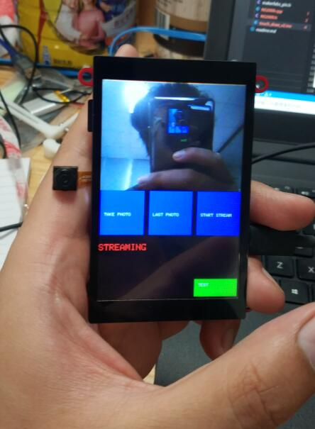
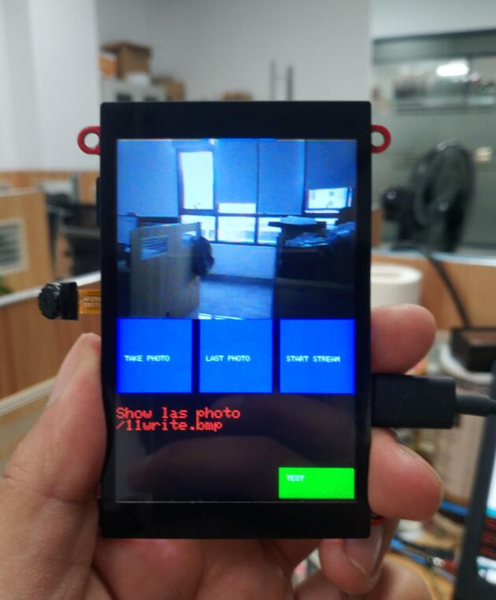
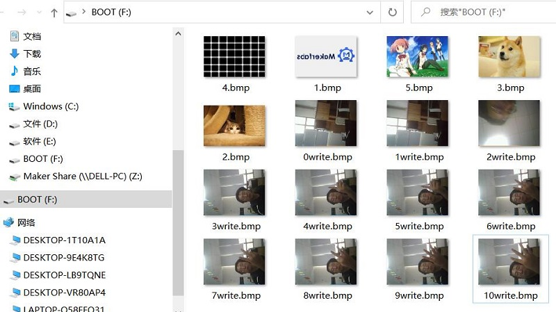
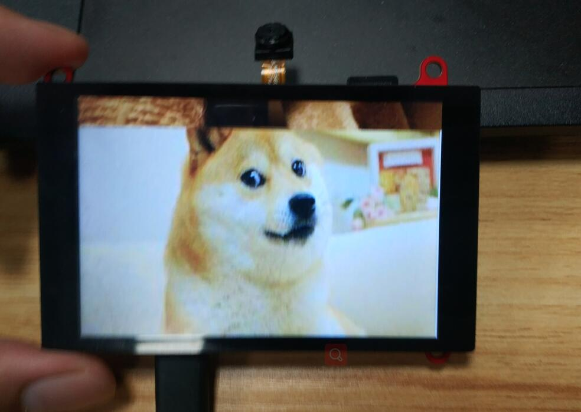
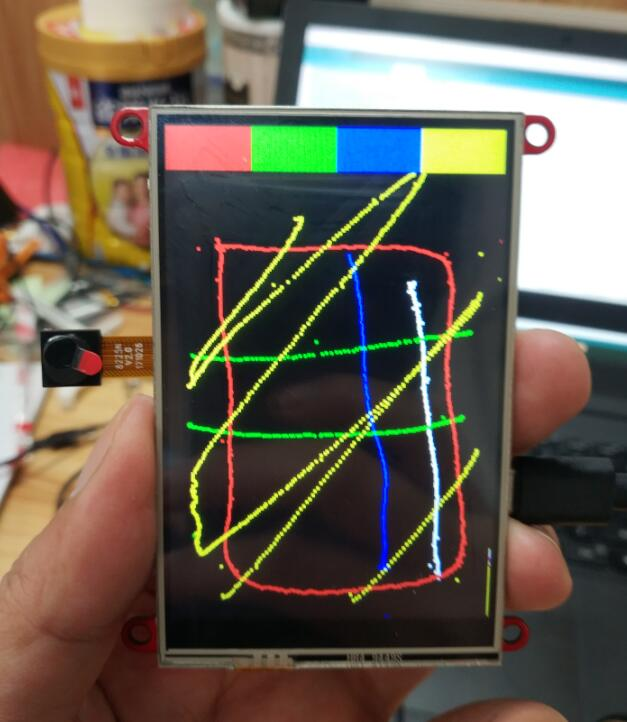

# Touch Screen Camera

```c++
/*
Version:		V1.0
Author:			Vincent
Create Date:	2020/8/19
Note:
	
*/
```


[toc]

# OVERVIEW

## Introduce

[Makerfabs home page](https://www.makerfabs.com/)

[Makerfabs Wiki](https://makerfabs.com/wiki/index.php?title=Main_Page)

The realization of a simple digital camera, you can take pictures through the camera, framing.It is displayed on the TFT screen and provides touch options.Photos taken can be saved on an SD card.

## Equipment list

- ESP32 Touch Camera
- Micro SD card


# ESP32 Touch Camera

## ~~Product link ：~~[ ~~ESP32 6- Axis IMU~~](https://www.makerfabs.com/esp32-6-axis-imu.html) 

The ESP32 Touch Camera USES the ILI9488 screen, which comes with resistive and capacitive screens.And an OV2640 camera and SD card slot.It can be used as a webcam, an electronic album, or a digital camera.Support for Arduino and MicroPython.This project

## Feature

- Integrated ESP32 2.4G WiFi and Bluetooth
- Input 5.0V Type-C USB 
- OV2640 is a 1/4 inch CMOS UXGA (1632*1232) image sensor manufactured by OmniVision.
- LCD 3.5 inch Amorphous-TFT-LCD (Thin Film Transistor Liquid Crystal Display) for mobile-phone or handy electrical equipments.
- Size: max 100mmX100mmX9mm


# STEPS

## Prepare And Burn

**If you have any questions，such as how to install the development board, how to download the code, how to install the library. Please refer to :[Makerfabs_FAQ](https://github.com/Makerfabs/Makerfabs_FAQ)**

- Install board : esp32 .
- Install library : Adafruit GFX library.
- Modify the code based on the touch screen.Use the resistive screen to remove the NS2009 comment and the capacitive screen to remove the FT6236 comment.
- 
```c++
//#define NS2009_TOUCH
#define FT6236_TOUCH

#ifdef NS2009_TOUCH
#include "NS2009.h"
const int i2c_touch_addr = NS2009_ADDR;
#endif

#ifdef FT6236_TOUCH
#include "FT6236.h"
const int i2c_touch_addr = TOUCH_I2C_ADD;
#endif

```

- Upload file "/Project_Touch-Screen-Camra/Camera/Camera.ino"

- Insert a Micro SD card into ESP32 Touch Camera.


## How to use ESP32 Touch Camera

- Open the serial port monitor after uploading the code.
- Serial port will return initialization information, pay attention to see if there is any error.

```txt
14:48:49.096 -> ets Jun  8 2016 00:22:57
14:48:49.096 -> 
14:48:49.096 -> rst:0x1 (POWERON_RESET),boot:0x17 (SPI_FAST_FLASH_BOOT)
14:48:49.096 -> configsip: 0, SPIWP:0xee
14:48:49.096 -> clk_drv:0x00,q_drv:0x00,d_drv:0x00,cs0_drv:0x00,hd_drv:0x00,wp_drv:0x00
14:48:49.096 -> mode:DIO, clock div:1
14:48:49.096 -> load:0x3fff0018,len:4
14:48:49.096 -> load:0x3fff001c,len:1100
14:48:49.096 -> load:0x40078000,len:9232
14:48:49.096 -> load:0x40080400,len:6400
14:48:49.096 -> entry 0x400806a8
14:48:50.641 -> ILI9488 Test!
14:48:50.641 -> I2C device found at address 0x38  !
14:48:50.675 -> Card Mount Successed
14:48:50.675 -> SD init over.
14:48:51.397 -> TFT init over.
14:49:10.660 -> Image name：/0write.bmp
14:49:13.859 -> Image name：/1write.bmp

```


- If the SD card cannot be mounted on return, you need to re-insert the SD card.
- If everything is normal, the camera interface will be displayed.



- Press the camera button to take photos automatically.
- Click on the previous photo to show the last photo saved on the SD card.



- Pressing to show the last photo will stop the camera acquisition. To restore the preview, press open Stream.
- Restore stream mode to take photos again.
- You can unplug your SD card and plug it into your computer to view your photos.




# Project Description

The Touch Camera contains a lot of parts, including ESP32, the screen, the Touch screen and the Camera.Below is the test code for each component, and the final combination of the digital camera project.

## TFT screen
### ILI9488

ILI9488 doesn't have an official library under Arduino, but it has a modified version based on a third-party driver on Github.Adafruit GFX library can realize the basic functions: draw points, lines, geometric figures, direction adjustment, bitmap display and so on.

- /Project_Touch-Screen-Camra/ILI9488 ：ILI9488 driver.

Library file, cannot be run directly.

- /Project_Touch-Screen-Camra/9488test：ILI9488 screen test, SD card test.

Run various drawing functions and read the SD card list.

- /Project_Touch-Screen-Camra/SD2TFT ：Display pictures from SD card.

Loop back the images in the SD card.



## Touch Screen

### NS2009

NS2009 is an I2C protocol resistance screen drive IC, output X, Y, Z1, Z2 four axis 12 bit data.

### FT6236

FT6236 is a capacitive screen driver IC of I2C protocol, which directly outputs the coordinate value after filtering.

- /Project_Touch-Screen-Camra/touch_screen_driver_example/ft6236 : FT6236 Driver demonstration

- /Project_Touch-Screen-Camra/touch_screen_driver_example/ns2009 ：NS2009 Driver demonstration

- /Project_Touch-Screen-Camra/touch_screen_driver_example/i2c_scanner ：I2C scanner

- /Project_Touch-Screen-Camra/touch_draw ：\- Touch screen drawing test, COMPATIBLE with NS2009 and FT6236

Use your hand or stylus (resistance screen) to draw on the screen.




## Camera

### OV2640

OV2640 is a 1/4 inch CMOS UXGA (1632*1232) image sensor manufactured by OmniVision.Support automatic exposure control, automatic gain control, automatic white balance, automatic elimination of light stripes and other automatic control functions.UXGA can reach up to 15 frames per second, SVGA up to 30 frames, CIF up to 60 frames. Image compression is supported, JPEG image data can be output.

- /Project_Touch-Screen-Camra/CAM2TFT : The camera is displayed to the TFT screen for testing.

Simply display the images captured by the camera on the screen.

- /Project_Touch-Screen-Camra/Camera ：Camera program.


Contains images captured by the live display camera.Save the photo to an SD card.Browse the images saved on the SD card.Touch screen analog button control.